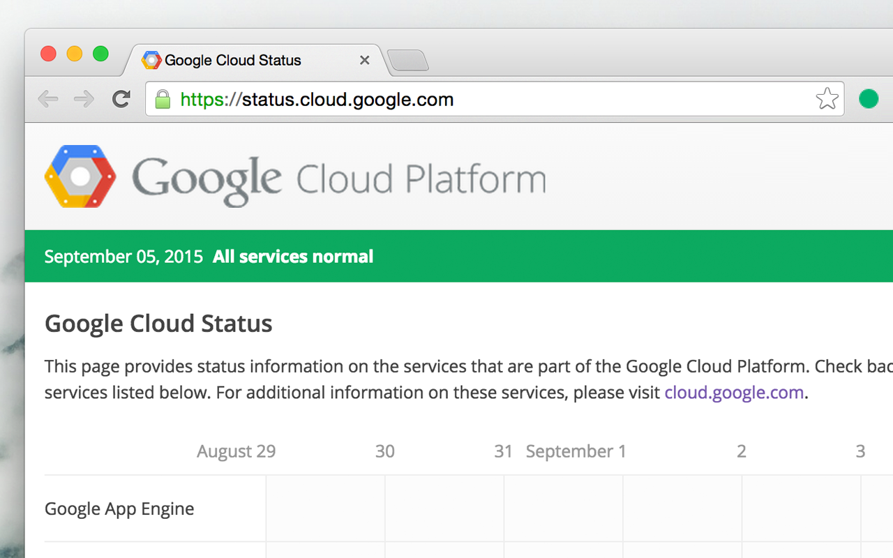

# gcp-status
> Stay alert of Google Cloud Platform service outages. (Note: Not an official extension)

Install a colored circle into your Chrome icon bar that represents when the status of the Google Cloud Platform. It is refreshed once an hour with data pulled from https://status.cloud.google.com/

The icon also acts as a quick link to the official site for detailed information on all of the services and any reported downtime at https://status.cloud.google.com/